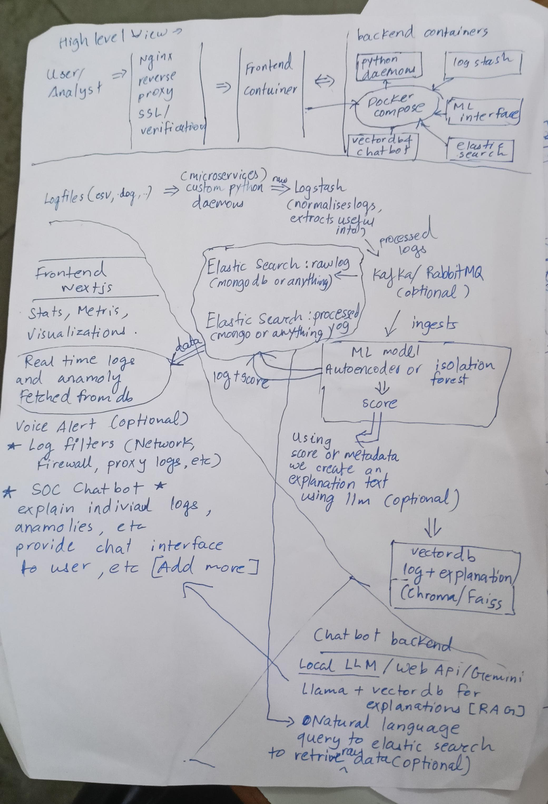

# Automated Log Analysis (SOC)



> Automated pipeline for ingesting, processing, analyzing, and explaining logs with ML-driven anomaly detection and a chatbot interface for security analysts.

---

## Overview

This repository contains the architecture and supporting code for an automated log analysis system designed to help SOC analysts: ingest logs from multiple sources, normalize and index them, run anomaly detection models, and provide human-friendly explanations via a chatbot backed by a vector store and LLMs.

The architecture image above (`architecture.jpeg`) shows the high-level components and data flow.

## Key components

* **Ingress / Collection**: Custom Python daemons (microservices) to tail/collect logs (CSV, syslog, app logs, firewall/proxy logs) and forward to a processing pipeline.
* **Log Processing**: Logstash (or custom processors) to normalize logs and extract useful fields.
* **Message Bus (optional)**: Kafka / RabbitMQ for buffering and decoupling ingestion from processing.
* **Storage / Search**:

  * *Raw logs*: Elasticsearch (or MongoDB/any document store) for raw log storage and ad-hoc queries.
  * *Processed logs*: Elasticsearch index for normalized/processed logs used by dashboards and analytics.
* **ML / Anomaly Detection**: Autoencoders or Isolation Forests to score log events for anomalies. Scores and metadata are saved alongside logs.
* **Vector DB & Explanations**: Vector DB (e.g. Chroma / FAISS) stores embeddings and explanation text for retrieval by the chatbot.
* **Chatbot Backend**: Local LLM or external Web API (Llama, OpenAI/Gemini, etc.) + vectorDB to answer queries about logs and provide explanations.
* **Frontend**: Next.js dashboard for real-time metrics, visualization of logs, and a chat interface (SOC chatbot).
* **Orchestration**: Docker Compose to spin up the components easily for local dev/testing.
* **Reverse Proxy & Security**: Nginx for SSL/verification and routing to the frontend and API.

## Data Flow (short)

1. Logs are collected by Python daemons -> forwarded to Logstash or a processor.
2. Logstash normalizes and extracts fields -> writes processed logs to Elasticsearch (processed index) and raw logs to raw index (or DB).
3. Processed logs are scored by the ML model -> anomaly score appended.
4. High-value logs + explanations are embedded and written into a vector DB.
5. Frontend (Next.js) queries Elasticsearch for metrics and uses the chatbot backend + vector DB for natural language explanations and deeper investigations.

## Tech stack suggestions

* Python (log collectors, ML logic)
* Logstash / Beats
* Elasticsearch (or OpenSearch)
* Kafka or RabbitMQ (optional)
* Docker & Docker Compose
* Next.js (dashboard)
* Vector DB: Chroma or FAISS
* Local LLMs: Llama-based models or remote LLM APIs

## Quickstart (local)

1. Clone this repo:

```bash
git clone <your-repo-url>
cd <repo>
```

2. Make sure `architecture.jpeg` is placed in the repository root.

3. Create an `.env` file for any environment variables used by services (examples provided in `/examples` or `/env.example` if present).

4. Start services with Docker Compose (example):

```bash
docker compose up -d
```

> Note: This repo contains architecture and scaffolding. Adjust service names and env vars as needed.

## Development

* **Frontend**: `cd frontend && npm install && npm run dev`
* **Backend**: `cd backend && pip install -r requirements.txt && python app.py`
* **ML**: `cd ml` — tools to train/test the autoencoder or isolation forest.

## How to use the chatbot

* Use the dashboard chat UI to ask:

  * "Show me recent high anomaly scores in the last 24 hours"
  * "Explain why log entry ID `abc123` is anomalous"
* The chatbot backend will use the vector DB and LLM to fetch relevant logs and explanations.

## Configuration ideas

* Index retention policies for raw vs processed logs
* Thresholds for anomaly score alerting
* Integration with alerting channels (Slack, Email, PagerDuty, Voice Alerts)

## Contributing

Contributions welcome! Please open issues for feature requests and bug reports.

## Files & Folders (suggested)

```
README.md
architecture.jpeg
docker-compose.yml
frontend/
backend/
ml/
```

## License

MIT License — change as appropriate.
